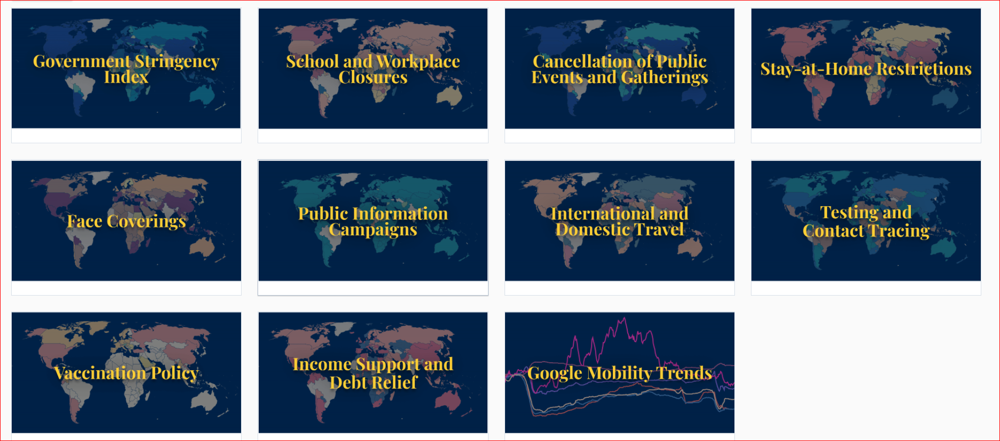
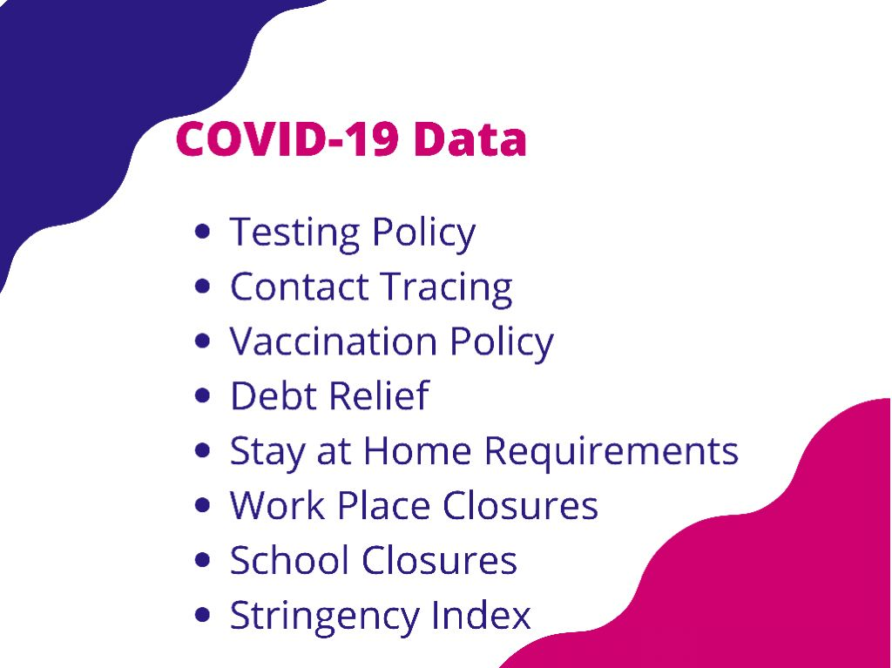
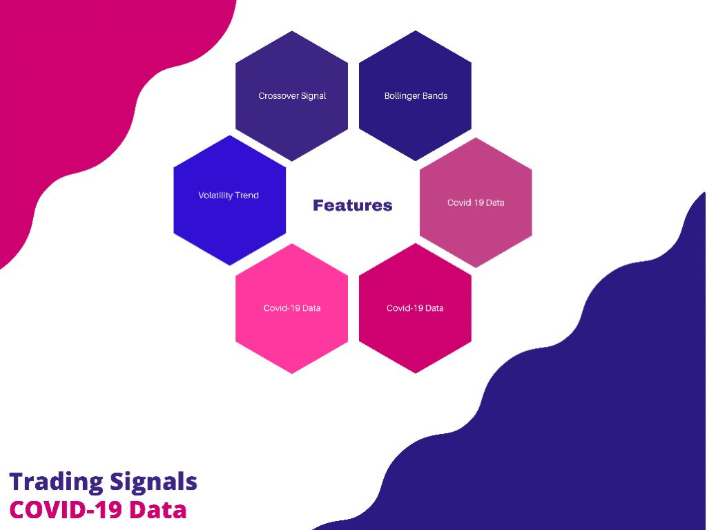
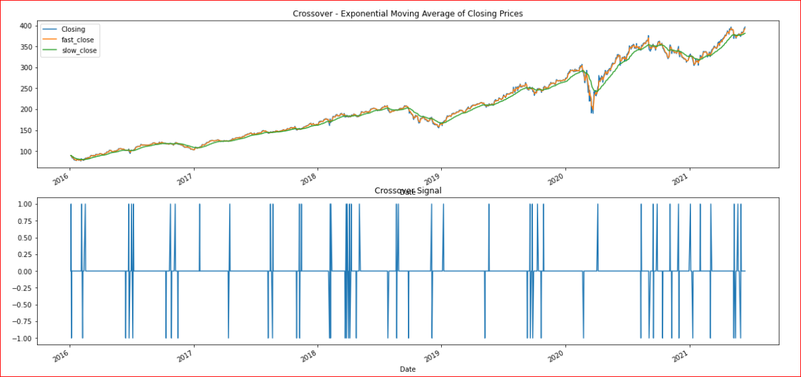
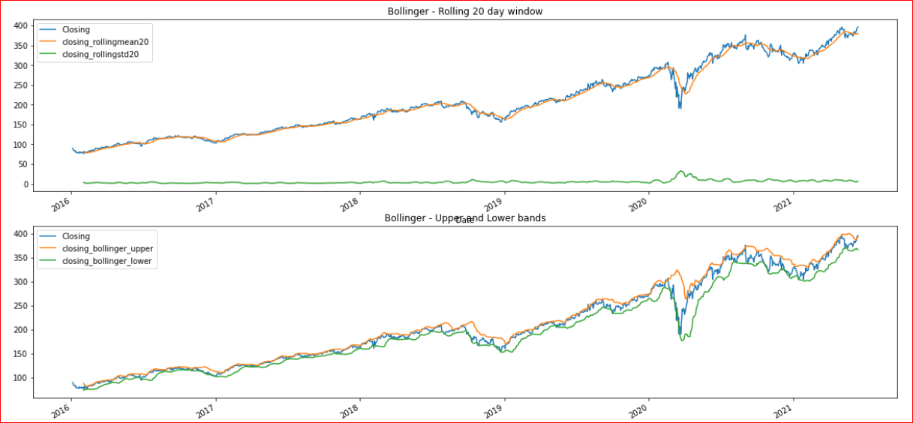
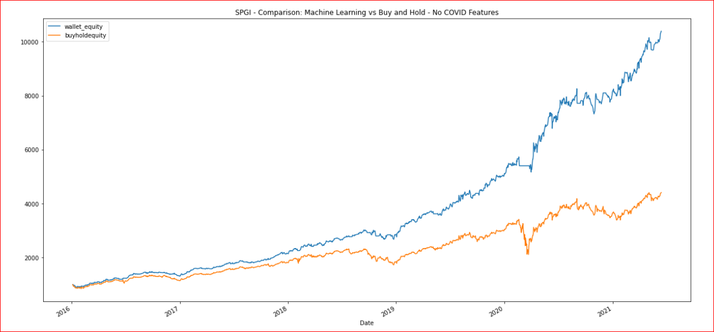

# "Portfolio Optimization Prediction with Machine Learning"
Fintech Bootcamp Project-2 Group-2

 By Sherin Solomon. Carolina Corona. Omotara Ajayi, Sinan Colpan, Vincent Wen


# Table of contents:

- [HYPOTHESIS](#hypothesis)

- [PREREQUISITES](#prerequisites)

- [DATA](#data)
    - [Gathering](#gathering)

    - [Preparation](#preparation)

    - [Assumptions](#assumptions)

- [PREDICTIVE MODEL](#predictive-model)
	- [Training](#training)

    - [Evaluating & Tuning](#evaluating-&-tuning)

	- [Prediciton](#prediction)	
	
- [CONCLUSION](#conclusion)
	


# HYPOTHESIS 
**Can we use Machine Learning to see the best performing ETF amongst a cluster of Top picked ETFs across different sectors and see if Covid-19 data has any correlation with the performance of said ETFs?**

# Prerequisites

### Libraries Utilized:

```shell
 - sklearn.ensemble
 - pandas
 - yfinance
 - matplotlib.pyplot
 - Numpy
 - hvplot.pandas
 - os 
```

# DATA

### Gathering

- ETF data
Utilised Yahoo finance APi [Yfinance](https://pypi.org/project/yfinance/) for all ETF data utilized


- COVID-19 data

All the COVID-19 data was extracted from [Our World in Data](https://ourworldindata.org/policy-responses-covid)  and only Data from the United States wasn used




### Preparation

- ETF data.

We prepared our data by using Yahoo Finance and identified 60 ETF Growth Tickers across multiple industries and and created a CSV . For historical and current data we used Yahoo Finance . We dropped our Nulls and got closing prices for all Tickers . Our target timeline is 5 years . 

- COVID-19 data.

We used Statsistics for the COVID-19 categories mentioned below. 
Data was utilized only when available and no nulls were droped.




```shell

COVID-19 Data Dictionary

0- No Data Available
1- No policy
2- Recommended
3- Required in some 
4- Required in all 
5- Mandatory


```


### Assumptions

The results are bades on an initial $1,000 invested in each ETF to compare performance.

The Predicitions and Conclusuions are based on the ETF 
**SPGI**  

No trading fees were considered at any point during this project.

COVID-19 data was utilised only when available


# PREDICTIVE MODEL

The model chosen was **Random Forest Resgressor**

### Training
We chose a Supervised Model as we wanted to train the data and Run Simulations. 
We utilised three trading signals as features, after the trafing signals were tuned, the COVID-19 data vas added as features as well.



### Evaluating & Tuning


- **Crossover Signal**

Included this signal to ensures that we have a buy or a sell signal only when there is a switch happening.

If a buy or a sell signal doesn't change, we use 0 as hold as oppose to continuously displaying buy (1) or sell (-1)    

The crossover_toggle column is enumerated based on the values in the crossover_signal_temp column, if a signal repeats, it will increase the enumeration until the signal changes.


   
- **Bollinger Bands** 

Have the bands at a sigma of 2 and using a rolling mean of 20, we got to this numbers after trying 3 and 2.5 sigmas but we found them too noisy and the signal wanst as obvius.




### Prediction


_**SPGI**_  
Initial Investment of $1000 
Cumulative Return of $10,140 without COVID Data         
Cumulative Return of $15,435  with COVID Data

_**BENCHMARK RETURN**_

Initial Investment of $1000         
Cumulative Return of $1360.49 

# CONCLUSION

### Using the ticker SPGI in the image below.
We see some significant increases in equity, when applying the trading suggestions given to us by the regressor as opposed to buying the stocks from the beginning and holding on, during the same time frame. 

In addition, we have made even more money by including COVID features into our machine learning model. This data has perhaps helped us by finding correlations between the COVID policies and the stock performance, hence making much better trading suggestions that improved the profits.

I would definitely recommend this strategy of trading to anyone willing to reap the benefits of machine learning when it comes to trading





Find our Jupyter Notebook [here](https://github.com/scolpan/project_2/blob/main/ETFs.ipynb)


***This is not financial advice***


                                                                                                                                                   

